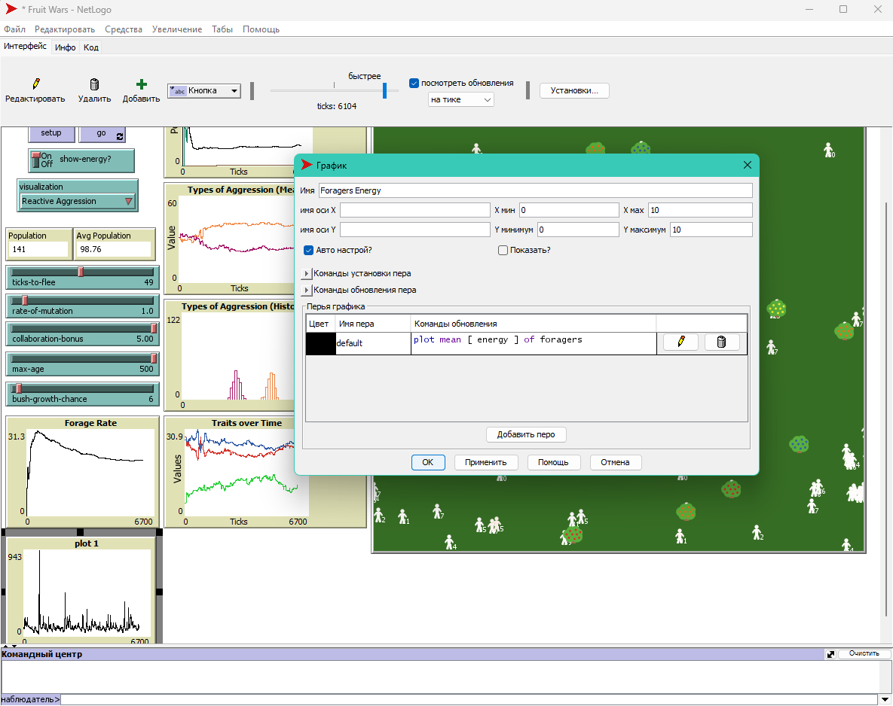
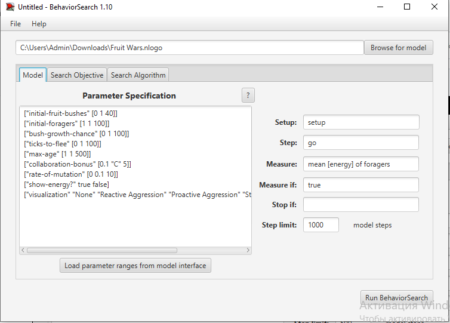
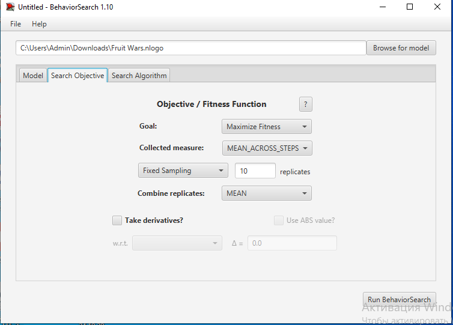
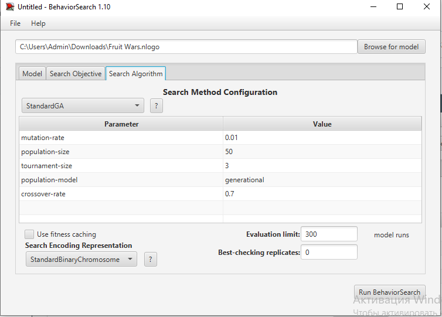
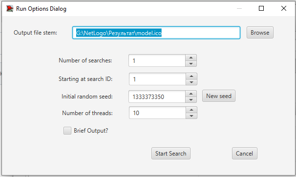
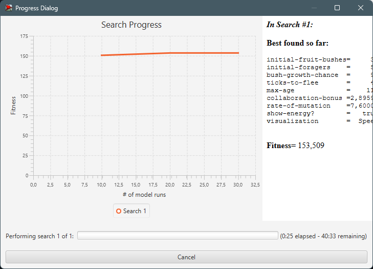
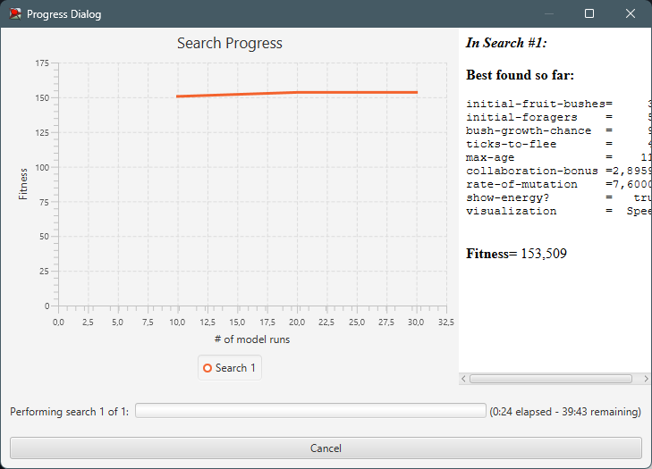

# Lab3KSIM
## Комп'ютерні системи імітаційного моделювання
## СПм-22-4, **Кононенко Олександр Миколайович**
### Лабораторна робота №**3**. Використання засобів обчислювального интелекту для оптимізації імітаційних моделей

 

### Варіант 13, модель у середовищі NetLogo:
[Fruit Wars](http://www.netlogoweb.org/launch#http://www.netlogoweb.org/assets/modelslib/Sample%20Models/Social%20Science/Economics/Fruit%20Wars.nlogo)

 

### Вербальний опис моделі:
Ця модель демонструє, як економічне середовище з ненульовою сумою може стимулювати співпрацю та перешкоджати насильству. Збирачі блукають картою у пошуках фруктових кущів. Коли вони досягають фруктового куща, вони отримують енергію, видобуваючи їжу, доки у фруктовому кущі не закінчаться ресурси. Ці тварини розмножуються та передають свої характеристики потомству, накопичивши певну кількість енергії. Вони також приймають рішення на основі спадкових параметрів про те, як взаємодіяти з іншими тваринами-збирачами. Збирачі можуть співпрацювати, загрожувати, боротися чи бігти за різних обставин.

### Параметри Setup:
- **initial-fruit-bushes** - визначає кількість плодових кущів на початку
- **initial-foragers** - визначає кількість збирачів на початку.

### Параметри візуалізації:
- **show-energy?** - відображає поточну енергію кожного окремого збирача поряд з ним, якщо увімкнено.
- **visualization** - масштабує колір агента залежно від вибору на основі значення цього параметра, причому світліші кольори представляють собою більш високі значення.

### Параметри, що можуть надавати вплив під час роботи симуляції:
- **ticks-to-flee** - кількість тіків, що повинно пройти після початку побігу збирача перед тим, як він почне шукати новий фруктовий кущ.
- **rate-of-mutation** - ймовірність того, що окремий біт перевернеться під час проходження біта генома від батька до нащадка.
- **collaboration-bonus** - коефіцієнт, який використовується для визначення рівня спільного пошуку їжі. Вищий бонус за співпрацю означає вищі показники збирання корму кількома збирачами на одному кущі.
- **max-age** - максимальна кількість тіків, що може прожити один збирач
- **bush-growth-chance** - шанс, щоб новий фруктовий кущ виростав на кожному кроці.

### Показники роботи системи:
- Population - кількість збирачів на даний момент часу.
- Avg Population - середня кількість одночасно існуючих збирачів.
- Traits over Time - середньостатистичне значення атрибутів збирачів.
- Deaths by Time - кількість та тип смертей.
- Types of Aggression(Mean/Histogram) - показник кількості виникнення агресії та типу її збудника.
- Forage Rate - середня кількість збираємого корму.

 

### Налаштування середовища BehaviorSearch:

**Обрана модель**:
<pre>
C:\Users\Admin\Downloads\Fruit Wars.nlogo
</pre>
**Параметри моделі** (вкладка Model):  
*Параметри та їх модливі діапазони були **автоматично** вилучені середовищем BehaviorSearch із вибраної імітаційної моделі, для цього є кнопка «Завантажити діапазони параметрів із інтерфейсу моделі»*:
<pre>
["initial-fruit-bushes" [0 1 40]]
["initial-foragers" [1 1 100]]
["bush-growth-chance" [0 1 100]]
["ticks-to-flee" [0 1 100]]
["max-age" [1 1 500]]
["collaboration-bonus" [0.1 "C" 5]]
["rate-of-mutation" [0 0.1 10]]
["show-energy?" true false]
["visualization" "None" "Reactive Aggression" "Proactive Aggression" "Strength" "Speed" "Intelligence"]
</pre>
Використовувана **міра**:  
Для фітнес-функції *(вона ж функція пристосованості або цільова функція)* було обрано **значення середньої енергії здобувачів**, зображення з налаштуваннями графіка аналізованої імітаційної моделі в середовищі NetLogo  
  
та вказано у параметрі "**Measure**":
<pre>
mean [ energy ] of foragers
</pre>
</pre>
Середня енергія всіх здобувачів повинна враховуватися **в середньому** за весь період симуляції тривалістю 300 тактів, починаючи з 0 такту симуляції.  
*Параметр "**Mesure if**" зі значення true, по суті, і означає, що враховуватимуться всі такти симуляції, а чи не частина їх. Іноді має сенс не враховувати деякі такти через хаос в деяких моделях на початку їх використання. Наприклад, це показано в прикладі з документації BehaviorSearch.  
Параметри "**Setup**" та "**Go**" вказують відповідні процедури ініціалізації та запуску в логіці моделі (зазвичай вони так і називаються). BehaviorSearch в процесі роботи, по суті, замість користувача запускає ці процедури.*  
Параметр зупинки за умовою ("**Stop if**") у разі не використовувався.  
Загальний вигляд вкладки налаштувань параметрів моделі:  

**Налаштування цільової функції** (вкладка Search Objective):  
Метою підбору параметрів імітаційної моделі є **максимізація** значення середньої енергії здобувачів – це вказано через параметр "**Goal**" зі значенням **Maximize Fitness**. Тобто необхідно визначити такі параметри налаштувань моделі, у яких здобувачі у процесі життя та розмноження покращують середнє значення енергії у окремого здобувача. При цьому цікавить не просто середня швидкість всіх машин у якийсь окремий момент симуляції, а середнє її значення за всю симуляцію (тривалість якої (3000 кроків) вказувалася на минулій вкладці). Для цього у параметрі "**Collected measure**", що визначає спосіб обліку значень обраного показника, вказано **MEAN_ACROSS_STEPS**.  
Щоб уникнути викривлення результатів через випадкові значення, що використовуються в логіці самої імітаційної моделі, **кожна симуляція повторюється по 10 разів**, результуюче значення розраховується як **середнє арифметичне**. 
Загальний вигляд вкладки налаштувань цільової функції:  

**Налаштування алгоритму пошуку** (вкладка Search Algorithm):  
Загальний вид вкладки налаштувань алгоритму пошуку:  

 

### Результати використання BehaviorSearch:
Діалогове вікно запуску пошуку *(можна залишити за замовчуванням, але стежте, куди пишеться результат)*:  

Результат пошуку параметрів імітаційної моделі, використовуючи **генетичний алгоритм**:  

Результат пошуку параметрів імітаційної моделі, використовуючи **випадковий пошук**:  

